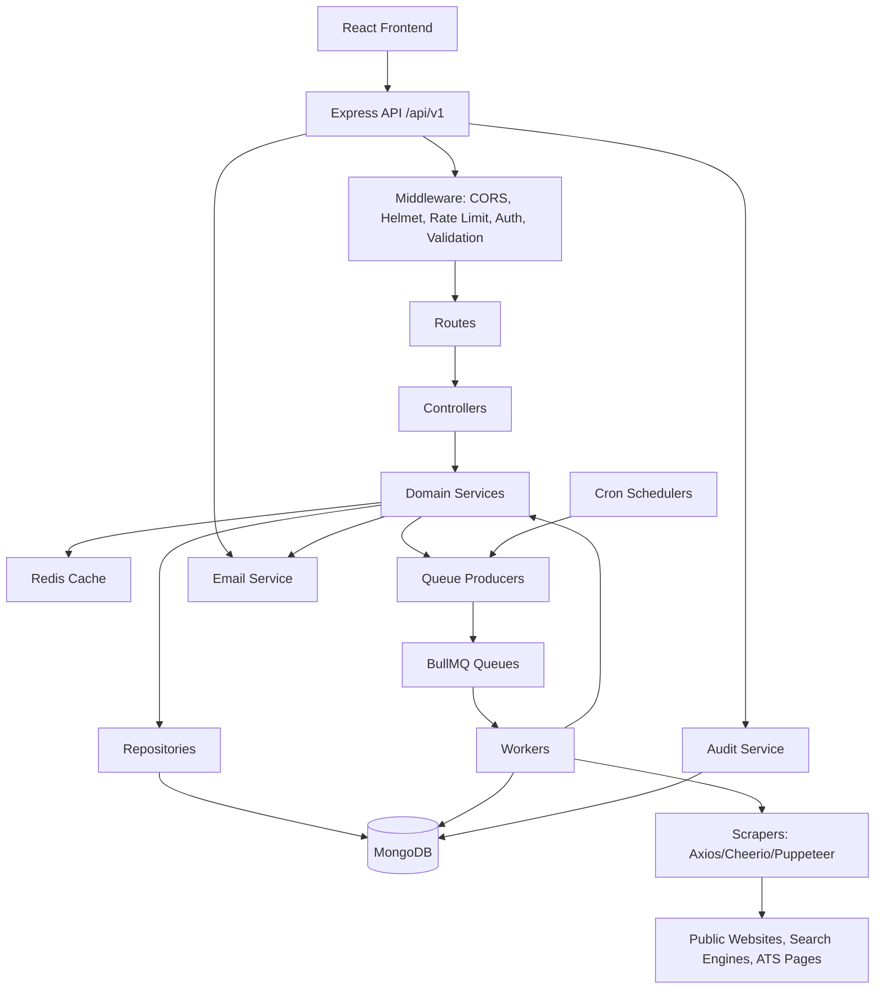
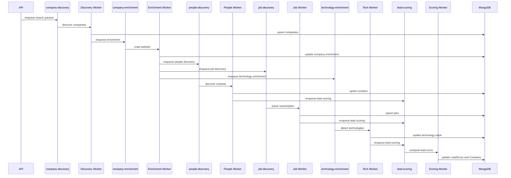

# AI Consulting Lead Intelligence Platform Architecture

## 1. Codebase Analysis Summary

The existing backend already contains the core building blocks for a real production lead-generation platform:

- HTTP API layer: Express app, route modules, controllers, auth middleware, validation, error handling, and rate limiting.
- Domain layer: services and repositories around companies, contacts, jobs, analytics, and sessions.
- Persistence: MongoDB via Mongoose, with an explicit memory mode for local/demo runs.
- Queue pipeline: BullMQ queue producers and worker consumers for discovery, enrichment, people collection, job scraping, technology scanning, and lead scoring.
- Scraper primitives: Puppeteer, Axios/Cheerio, and crawler utilities already exist under src/scrapers and src/workers.
- Operations: Docker support, cron jobs, environment configuration, and health endpoints are already present.

The main production gaps are not missing capabilities, but the need to standardize the architecture for a real-time AI consulting workflow:

- consolidate duplicate route/controller naming patterns,
- introduce explicit scraping-session and lead-history modules,
- add Socket.IO-based live progress streaming,
- expose queue health and worker controls for start/pause/resume/stop/kill,
- formalize saved leads, AI opportunity scoring, notes, tags, and export workflows.

## 2. Production-Grade Target Architecture

The platform should be organized as a modular, event-driven system:

- API process: Express REST endpoints for companies, jobs, leadership, saved leads, sessions, analytics, queue status, and exports.
- Worker process: BullMQ consumers for discovery, enrichment, dedupe, validation, lead scoring, and job parsing.
- Real-time process: Socket.IO server to stream session progress, queue metrics, and discovered leads to the frontend without refresh.
- Persistence: MongoDB for durable company, job, leadership, session, notes, and queue-log records.
- Cache/queue: Redis for BullMQ and real-time counters; memory mode remains available for local development.
- Scraping layer: deterministic crawler + browser fallback using Puppeteer when public pages require JavaScript rendering.

## 3. Proposed Folder Structure

Recommended target structure:

```text
project-be/
  src/
    app.js
    server.js

    config/
      env.js
      database.js
      redis.js
      cors.js
      logger.js
      rateLimit.js

    common/
      errors/
        AppError.js
        errorCodes.js
      middlewares/
        authenticate.js
        authorize.js
        apiKeyAuth.js
        errorHandler.js
        notFound.js
        validate.js
      utils/
        asyncHandler.js
        pagination.js
        queryBuilder.js
        response.js
        crypto.js
        dates.js

    modules/
      auth/
        auth.routes.js
        auth.controller.js
        auth.service.js
        auth.validators.js
      users/
        user.model.js
        user.repository.js
        user.routes.js
        user.controller.js
        user.service.js
      organizations/
        organization.model.js
        organization.repository.js
        organization.routes.js
        organization.controller.js
        organization.service.js
      companies/
        company.model.js
        company.repository.js
        company.routes.js
        company.controller.js
        company.service.js
        company.validators.js
      contacts/
        contact.model.js
        contact.repository.js
        contact.routes.js
        contact.controller.js
        contact.service.js
      jobs/
        job.model.js
        job.repository.js
        job.routes.js
        job.controller.js
        job.service.js
      analytics/
        analytics.routes.js
        analytics.controller.js
        analytics.service.js
      saved-lists/
        savedList.model.js
        savedList.repository.js
        savedList.routes.js
        savedList.controller.js
        savedList.service.js
      api-keys/
        apiKey.model.js
        apiKey.routes.js
        apiKey.controller.js
        apiKey.service.js
      audit/
        auditLog.model.js
        audit.routes.js
        audit.controller.js
        audit.service.js
      sessions/
        session.model.js
        refreshToken.model.js
        session.routes.js
        session.controller.js
        session.service.js
      lead-scoring/
        leadScore.model.js
        leadScoring.service.js

    infrastructure/
      email/
        email.service.js
        templates/
      queues/
        names.js
        connection.js
        queues.js
        producers.js
      scraping/
        httpClient.js
        pageLoader.js
        discovery/
          googleSearch.js
          bingSearch.js
          clutchScraper.js
        crawlers/
          websiteCrawler.js
          careersPageParser.js
        people/
          leadershipParser.js
          searchPeople.js
        technology/
          techDetector.js
        jobs/
          genericJobParser.js

    workers/
      index.js
      discovery.worker.js
      enrichment.worker.js
      people.worker.js
      jobs.worker.js
      technology.worker.js
      scoring.worker.js

    cron/
      index.js
      dailyCompanyRefresh.js
      dailyHiringRefresh.js
      weeklyContactRefresh.js
      weeklyTechRefresh.js

  tests/
    unit/
    integration/
    e2e/

  scripts/
    seed.js
    migrate.js

  Dockerfile
  docker-compose.yml
  package.json
  README.md
  ARCHITECTURE.md
```

Folder principles:

- `modules/*` owns domain behavior, model, repository, service, controller, route, and validators for one business capability.
- `infrastructure/*` owns adapters to external systems such as Redis, BullMQ, SMTP, Puppeteer, and third-party HTTP.
- `workers/*` owns queue consumers only. Workers call services and scrapers; they do not expose HTTP.
- `common/*` owns reusable middleware, errors, response shape, pagination, and query helpers.
- `config/*` owns environment parsing and service boot configuration.
- Tests mirror the module structure.

## 3. Architecture Diagram



Runtime process split:

- API process: handles HTTP requests, auth, CRUD, analytics, exports, job enqueueing.
- Worker process: consumes BullMQ jobs and performs discovery/enrichment/scoring.
- Cron process: periodically enqueues refresh jobs.
- MongoDB: durable source of truth.
- Redis: BullMQ backend, cache, rate-limit store if configured.
- Puppeteer: fallback browser automation for pages that cannot be parsed with Axios/Cheerio.

## 4. Database Schema

### Organization

Purpose: tenant boundary for users, saved lists, API keys, usage limits, and audit logs.

Fields:

- `_id`
- `name`
- `domain`
- `slug`
- `plan`: `free | starter | growth | enterprise`
- `usageLimits.leadsPerMonth`
- `usageLimits.exportsPerMonth`
- `usageLimits.apiCallsPerMonth`
- `usageLimits.maxUsers`
- `members[]`
- `members.userId`
- `members.role`
- `members.joinedAt`
- `isActive`
- `createdAt`
- `updatedAt`

Indexes:

- `slug` unique
- `domain`

### User

Purpose: application identity and RBAC subject.

Fields:

- `_id`
- `firstName`
- `lastName`
- `email`
- `passwordHash`
- `role`: `super_admin | org_owner | admin | manager | sales_user | read_only`
- `organizationId`
- `isVerified`
- `isActive`
- `googleId`
- `avatar`
- `mfaEnabled`
- `mfaSecret`
- `lastLoginAt`
- `createdAt`
- `updatedAt`

Indexes:

- `email` unique
- `organizationId`

### Company

Purpose: target account record and enrichment hub.

Fields:

- `_id`
- `companyName`
- `website`
- `email`
- `phone`
- `linkedinCompanyUrl`
- `industry`
- `subIndustry`
- `description`
- `headcount`
- `foundedYear`
- `careersUrl`
- `address`
- `city`
- `state`
- `country`
- `technologyStack[]`
- `socialLinks.linkedin`
- `socialLinks.twitter`
- `socialLinks.facebook`
- `socialLinks.instagram`
- `socialLinks.youtube`
- `hiringStatus`: `active | inactive | unknown`
- `hiringIntensity`
- `leadScore`
- `leadGrade`: `A | B | C | D | unscored`
- `discoverySource`
- `sourceUrl`
- `isEnriched`
- `lastTechnologyScannedAt`
- `isDeleted`
- `deletedAt`
- `deletedBy`
- `createdAt`
- `updatedAt`

Indexes:

- `website` unique sparse
- `linkedinCompanyUrl` unique sparse
- `companyName`
- `industry`
- `country`
- `leadScore`
- `technologyStack`
- `hiringStatus`
- `isDeleted`

### Contact

Purpose: decision-maker/person record related to a company.

Fields:

- `_id`
- `name`
- `designation`
- `department`
- `seniority`: `c_level | vp | director | manager | senior | mid | junior | unknown`
- `linkedinUrl`
- `email`
- `phone`
- `location`
- `companyId`
- `companyName`
- `sourceUrl`
- `isDeleted`
- `deletedAt`
- `createdAt`
- `updatedAt`

Indexes:

- `companyId`
- `designation`
- `seniority`
- `department`

### Job

Purpose: hiring signal record related to a company.

Fields:

- `_id`
- `title`
- `companyId`
- `companyName`
- `description`
- `location`
- `city`
- `country`
- `workplaceType`: `remote | hybrid | onsite | unknown`
- `employmentType`: `full_time | part_time | contract | internship | unknown`
- `jobUrl`
- `sourcePlatform`
- `postedDate`
- `expiresDate`
- `technologyKeywords[]`
- `requiredSkills[]`
- `industry`
- `department`
- `experienceMin`
- `experienceMax`
- `salaryMin`
- `salaryMax`
- `currency`
- `isActive`
- `isDeleted`
- `deletedAt`
- `createdAt`
- `updatedAt`

Indexes:

- `companyId`
- `title`
- `industry`
- `country`
- `workplaceType`
- `postedDate`
- `requiredSkills`

### LeadScore

Purpose: explainable score breakdown for a company.

Fields:

- `_id`
- `companyId`
- `signals.ceoFound`
- `signals.ctoFound`
- `signals.hiringEngineers`
- `signals.hiringAiTalent`
- `signals.usesAws`
- `signals.usesSalesforce`
- `signals.usesHubspot`
- `signals.activeCareerPage`
- `signals.largeHeadcount`
- `scores.hiringScore`
- `scores.growthScore`
- `scores.technologyScore`
- `scores.decisionMakerScore`
- `scores.totalScore`
- `grade`: `A | B | C | D`
- `gradedAt`
- `createdAt`
- `updatedAt`

Indexes:

- `companyId` unique

### SavedList

Purpose: user or organization-defined sets of companies and contacts.

Fields:

- `_id`
- `name`
- `description`
- `userId`
- `organizationId`
- `companyIds[]`
- `contactIds[]`
- `isDeleted`
- `createdAt`
- `updatedAt`

Recommended indexes:

- `organizationId`
- `userId`
- `isDeleted`

### ApiKey

Purpose: organization API access for integrations.

Fields:

- `_id`
- `organizationId`
- `userId`
- `name`
- `keyHash`
- `keyPrefix`
- `scopes[]`
- `isActive`
- `lastUsedAt`
- `usageCount`
- `createdAt`
- `updatedAt`

Indexes:

- `keyHash` unique
- `organizationId`

### AuditLog

Purpose: compliance and operational activity trail.

Fields:

- `_id`
- `userId`
- `organizationId`
- `action`
- `collection`
- `recordId`
- `ipAddress`
- `userAgent`
- `metadata`
- `createdAt`
- `updatedAt`

Indexes:

- `userId`
- `organizationId`
- `action`
- `createdAt`

### Session and RefreshToken

Purpose: device/session tracking and refresh-token lifecycle.

Session fields:

- `_id`
- `userId`
- `ip`
- `userAgent`
- `device`
- `browser`
- `os`
- `loginAt`
- `lastActiveAt`
- `isActive`
- `createdAt`
- `updatedAt`

RefreshToken fields:

- `_id`
- `token`
- `userId`
- `expiresAt`
- `isRevoked`
- `deviceInfo`
- `createdAt`
- `updatedAt`

Indexes:

- `RefreshToken.token` unique
- `RefreshToken.userId`
- `Session.userId`
- `Session.isActive`

## 5. API Design

All JSON APIs should use a consistent envelope:

```json
{
  "success": true,
  "message": "Human-readable status",
  "data": {},
  "pagination": null,
  "error": null
}
```

Error response:

```json
{
  "success": false,
  "message": "Human-readable error",
  "data": null,
  "pagination": null,
  "error": {}
}
```

Base URL:

```text
/api/v1
```

### Auth

| Method | Path | Auth | Purpose |
|---|---|---:|---|
| POST | `/auth/register` | Public | Create organization owner account |
| POST | `/auth/login` | Public | Issue access and refresh tokens |
| POST | `/auth/refresh` | Public | Rotate refresh token and issue new access token |
| POST | `/auth/refresh-token` | Public | Backward-compatible refresh endpoint |
| POST | `/auth/logout` | User | Revoke refresh token/session |
| POST | `/auth/logout-all` | User | Revoke all sessions |
| GET | `/auth/verify-email?token=` | Public | Verify email |
| POST | `/auth/forgot-password` | Public | Start password reset |
| POST | `/auth/reset-password` | Public | Complete password reset |
| POST | `/auth/google` | Public | Google login |

### User and Sessions

| Method | Path | Auth | Purpose |
|---|---|---:|---|
| GET | `/user/profile` | User | Current user profile |
| PATCH | `/user/profile` | User | Update current user profile |
| DELETE | `/user/account` | User | Deactivate own account |
| GET | `/sessions` | User | List active sessions |
| DELETE | `/sessions/:id` | User | Logout specific session |

### Companies

| Method | Path | Auth | Purpose |
|---|---|---:|---|
| GET | `/companies` | User/API key | List companies |
| GET | `/companies/:id` | User/API key | Full company profile with contacts, jobs, lead score |
| POST | `/companies` | User | Create company |
| PUT | `/companies/:id` | User | Update company |
| DELETE | `/companies/:id` | User | Soft delete company |
| POST | `/companies/search` | User | Sync search or async discovery |
| POST | `/companies/bulk` | User | Bulk upsert companies |
| GET | `/companies/export?format=csv` | User | Export companies |

List query parameters:

- `page`
- `limit`
- `sort`
- `order`
- `industry`
- `country`
- `city`
- `headcountMin`
- `headcountMax`
- `hiringStatus`
- `technologyStack`
- `keywords`

### Contacts

| Method | Path | Auth | Purpose |
|---|---|---:|---|
| GET | `/contacts` | User/API key | List contacts |
| GET | `/contacts/:id` | User/API key | Get contact |
| POST | `/contacts` | User | Create contact |
| PUT | `/contacts/:id` | User | Update contact |
| DELETE | `/contacts/:id` | User | Soft delete contact |

Common filters:

- `companyId`
- `companyName`
- `department`
- `seniority`
- `designation`
- `keywords`
- `page`
- `limit`
- `sort`
- `order`

### Jobs

| Method | Path | Auth | Purpose |
|---|---|---:|---|
| GET | `/jobs` | User/API key | List jobs |
| GET | `/jobs/:id` | User/API key | Get job |
| POST | `/jobs` | User | Create job |
| PUT | `/jobs/:id` | User | Update job |
| DELETE | `/jobs/:id` | User | Soft delete job |

Common filters:

- `companyId`
- `industry`
- `country`
- `department`
- `workplaceType`
- `employmentType`
- `isActive`
- `keywords`
- `page`
- `limit`
- `sort`
- `order`

### Analytics

| Method | Path | Auth | Purpose |
|---|---|---:|---|
| GET | `/analytics/overview` | User | Total companies, contacts, jobs, average lead score |
| GET | `/analytics/hiring` | User | Hiring intensity and top hiring industries |
| GET | `/analytics/industries` | User | Industry distribution |
| GET | `/analytics/lead-scores` | User | A/B/C/D lead score distribution |

### Organizations and Team

| Method | Path | Auth | Purpose |
|---|---|---:|---|
| POST | `/organizations` | User | Create organization |
| GET | `/organizations/:id` | Org member | Get organization |
| PUT | `/organizations/:id` | Admin | Update organization |
| DELETE | `/organizations/:id/members/:userId` | Admin | Remove member |
| PATCH | `/organizations/:id/members/:userId/role` | Admin | Update member role |
| GET | `/team` | Org member | List team |
| POST | `/team/invite` | Admin | Invite member |
| POST | `/team/accept` | Public/User | Accept invitation |
| PATCH | `/team/:userId/role` | Admin | Update role |
| DELETE | `/team/:userId` | Admin | Remove member |

### API Keys

| Method | Path | Auth | Purpose |
|---|---|---:|---|
| POST | `/api-keys` | Admin | Create key |
| GET | `/api-keys` | Admin | List key metadata |
| DELETE | `/api-keys/:id` | Admin | Revoke key |

### Saved Lists

| Method | Path | Auth | Purpose |
|---|---|---:|---|
| POST | `/saved-lists` | User | Create saved list |
| GET | `/saved-lists` | User | List saved lists |
| GET | `/saved-lists/:id` | User | Get saved list |
| PUT | `/saved-lists/:id` | User | Update saved list |
| DELETE | `/saved-lists/:id` | User | Delete saved list |
| POST | `/saved-lists/:id/companies` | User | Add company |
| DELETE | `/saved-lists/:id/companies/:companyId` | User | Remove company |

### Audit

| Method | Path | Auth | Purpose |
|---|---|---:|---|
| GET | `/audit-logs` | Admin | Paginated audit log search |

## 6. Queue Design

Queue backend:

- Redis stores BullMQ queues, job metadata, retries, delayed jobs, and worker locks.
- Every queue should use default retry policy:
  - `attempts: 3`
  - exponential backoff
  - base delay: `2000ms`
- Every job payload should include:
  - `organizationId`
  - `requestedByUserId`
  - `correlationId`
  - `source`
  - domain-specific payload fields

### Queue Pipeline



### Queue: `company-discovery`

Purpose: discover companies from search terms, industry, location, and source websites.

Producer:

- `POST /companies/search` with `async=true`
- Scheduled market discovery jobs

Payload:

- `query`
- `industry`
- `country`
- `city`
- `keywords`
- `maxResults`
- `organizationId`
- `requestedByUserId`

Worker responsibilities:

- Run Google/Bing/Clutch discovery.
- Normalize URLs and company names.
- Deduplicate by website and LinkedIn URL.
- Upsert companies.
- Enqueue `company-enrichment` for each discovered company.

### Queue: `company-enrichment`

Purpose: crawl company website and enrich company profile.

Payload:

- `companyId`
- `website`
- `organizationId`
- `requestedByUserId`

Worker responsibilities:

- Crawl homepage, about, contact, team, leadership, careers pages.
- Extract emails, phone, description, address, social links, LinkedIn URL, careers URL.
- Update company with enrichment fields.
- Enqueue people, jobs, technology, and lead-scoring jobs.

### Queue: `people-discovery`

Purpose: find decision makers and leadership contacts.

Payload:

- `companyId`
- `companyName`
- `website`
- `linkedinCompanyUrl`

Worker responsibilities:

- Search public web and LinkedIn result pages.
- Parse leadership/team pages.
- Normalize designation, department, seniority.
- Bulk upsert contacts.
- Enqueue lead scoring.

### Queue: `job-discovery`

Purpose: discover active hiring signals.

Payload:

- `companyId`
- `companyName`
- `website`
- `careersUrl`

Worker responsibilities:

- Detect ATS platform.
- Parse listing pages.
- Parse individual job pages.
- Extract title, location, department, workplace type, employment type, skills.
- Bulk upsert jobs.
- Update company hiring status/intensity.
- Enqueue lead scoring.

### Queue: `technology-enrichment`

Purpose: detect website technologies and business systems.

Payload:

- `companyId`
- `website`

Worker responsibilities:

- Parse scripts, links, headers, meta tags, comments, asset URLs.
- Detect frontend frameworks, CMS, analytics, CRM, cloud, payments, data tooling.
- Update `technologyStack` and `lastTechnologyScannedAt`.
- Enqueue lead scoring.

### Queue: `lead-scoring`

Purpose: compute explainable account score and grade.

Payload:

- `companyId`

Worker responsibilities:

- Load company, contacts, jobs.
- Calculate signals:
  - CEO found
  - CTO found
  - engineer hiring
  - AI/ML hiring
  - AWS usage
  - Salesforce usage
  - HubSpot usage
  - active careers URL
  - headcount greater than 200
- Persist `LeadScore`.
- Update company `leadScore` and `leadGrade`.

Suggested grade thresholds:

- `A`: `>= 80`
- `B`: `>= 60`
- `C`: `>= 40`
- `D`: `< 40`

## 7. Cron Design

Cron jobs should enqueue work instead of performing scraping directly.

| Cron | Purpose | Default Schedule |
|---|---|---|
| `dailyCompanyRefresh` | Re-enrich companies not updated in 24 hours | `0 2 * * *` |
| `dailyHiringRefresh` | Refresh jobs for active/enriched companies | `0 3 * * *` |
| `weeklyContactRefresh` | Discover contacts for companies with stale or missing contacts | `0 4 * * 1` |
| `weeklyTechRefresh` | Refresh technology stack for companies not scanned in 7 days | `0 5 * * 1` |

## 8. Production Readiness Guidelines

### Security

- Store only hashed API keys.
- Hash passwords with bcrypt.
- Rotate refresh tokens on every refresh.
- Enforce organization scoping in every repository query.
- Use rate limits on auth, discovery, export, and API key routes.
- Do not log secrets, raw API keys, passwords, refresh tokens, or scraper cookies.

### Reliability

- Keep scraping pure and side-effect free.
- Workers should be idempotent.
- Use deterministic upsert keys such as website, LinkedIn URL, job URL, and contact LinkedIn URL.
- Add dead-letter or failed-job monitoring for BullMQ.
- Add job correlation IDs and structured worker logs.

### Observability

- Log every API request with request ID.
- Log queue lifecycle events: queued, started, completed, failed, retried.
- Emit metrics for:
  - queue depth
  - job failure rate
  - scraper timeout rate
  - enrichment throughput
  - API latency
  - MongoDB query errors

### Local Testing Modes

Memory mode:

- `DATABASE_MODE=memory`
- No MongoDB required.
- No Redis required.
- Queues become mock queues.
- Best for API and frontend integration smoke tests.

Docker mode:

- `DATABASE_MODE=auto`
- MongoDB and Redis run through Docker Compose.
- API, worker, and cron can run as separate services.
- Best for production-like local testing.

## 9. Recommended Refactor Order

1. Remove duplicate lowercase/uppercase controllers, services, and routes.
2. Move feature files into `src/modules/*`.
3. Move queue, scraper, email, and Redis adapters into `src/infrastructure/*`.
4. Add organization scoping consistently to repositories.
5. Add integration tests for auth, companies, contacts, jobs, analytics, saved lists, and queues.
6. Add BullMQ dashboard or operational queue monitoring.
7. Add MongoDB migrations or seed scripts for repeatable local environments.
